### Part 1. Настройка **gitlab-runner**

##### Подними виртуальную машину *Ubuntu Server 22.04 LTS*.

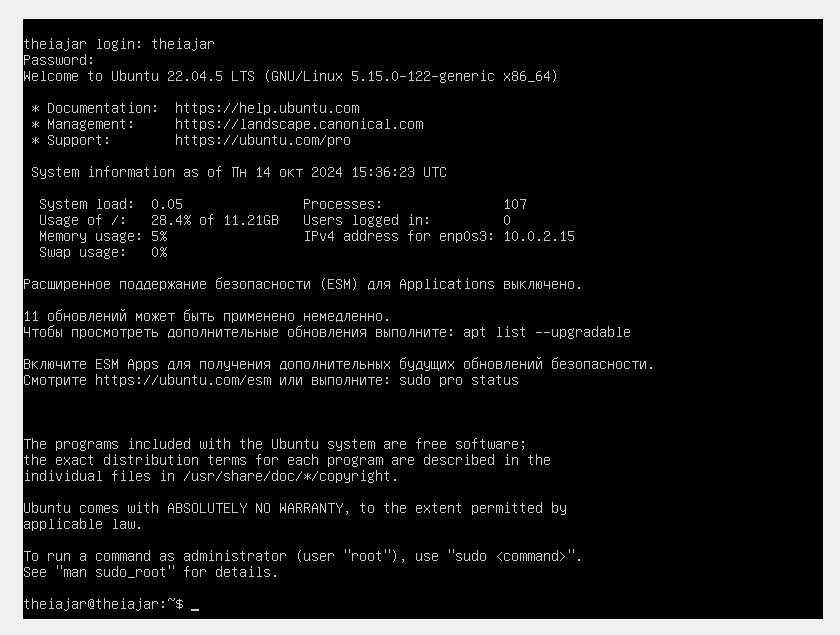

##### Скачал и установил на виртуальную машину **gitlab-runner**.

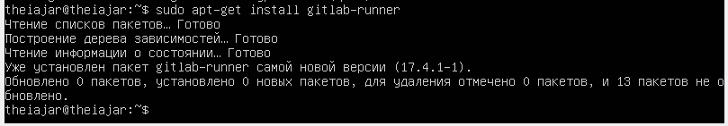

##### Запустил **gitlab-runner** и зарегистрировал его для использования в текущем проекте

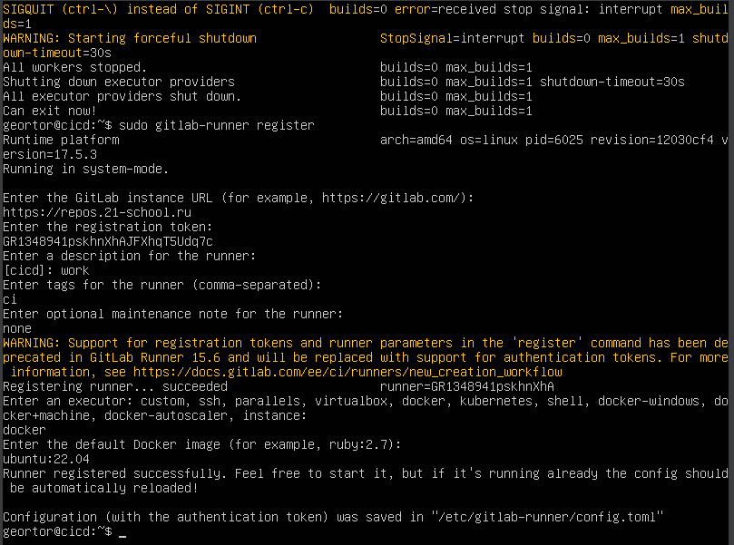

### Part 2. Сборка

#### Написал этап для **CI** по сборке приложений из проекта *C2_SimpleBashUtils*, а так же файлы, полученные после сборки, сохранил в произвольную директорию со сроком хранения 30 дней.

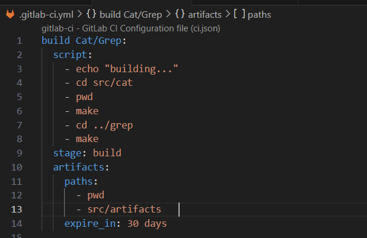

##### Проверям pipline

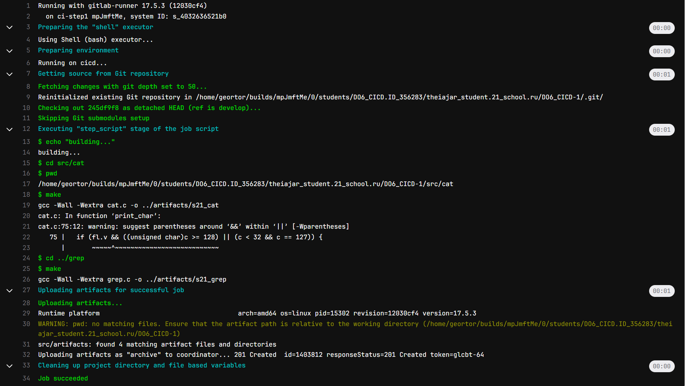

### Part 3. Тест кодстайла

#### Написал этап для **CI**, который запускает скрипт кодстайла (*clang-format*).

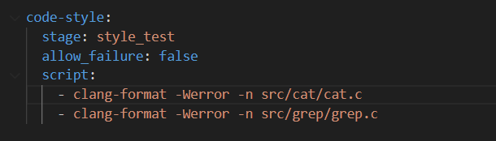

##### Если кодстайл не прошел, то «зафейлил» пайплайн.

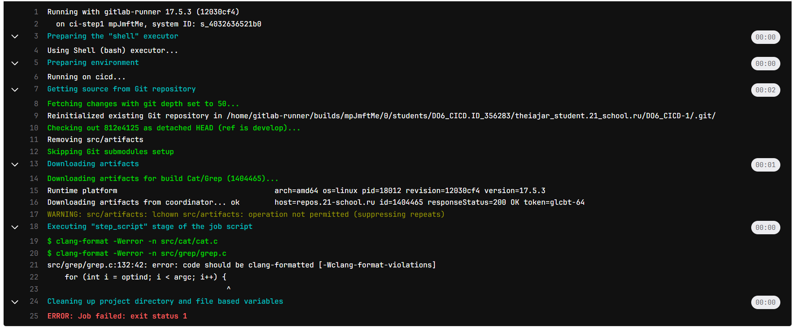

### Part 4. Интеграционные тесты

**== Задание ==**

#### Написал этап для **CI**, который запускает интеграционные тесты из того же проекта.

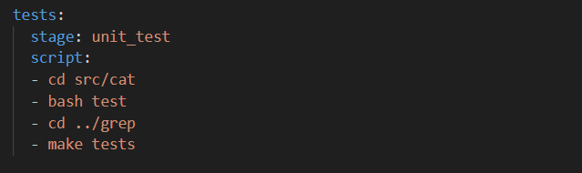

##### Если тесты не прошли, то пайплайн будет зафейлен.

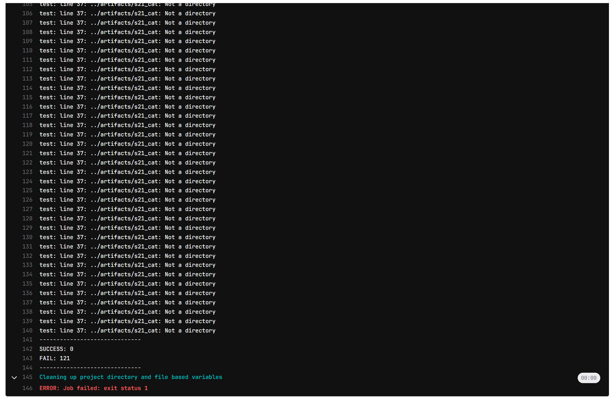

### Part 5. Этап деплоя

##### Поднял вторую виртуальную машину *Ubuntu Server 22.04 LTS*.

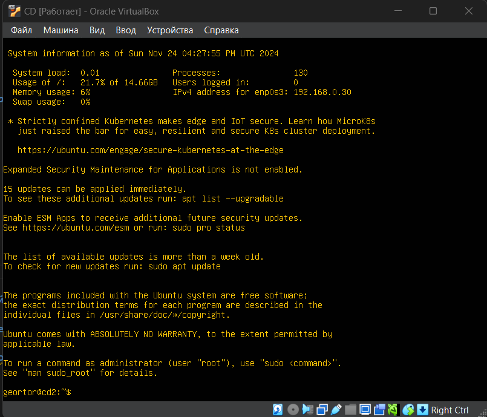

#### Написал этап для **CD**, который «разворачивает» проект на другой виртуальной машине.

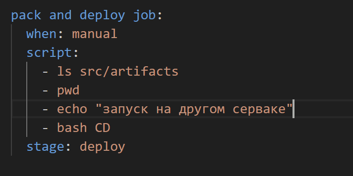

##### Написал bash-скрипт, который при помощи **ssh** и **scp** копирует файлы, полученные после сборки (артефакты), в директорию */usr/local/bin* второй виртуальной машины.

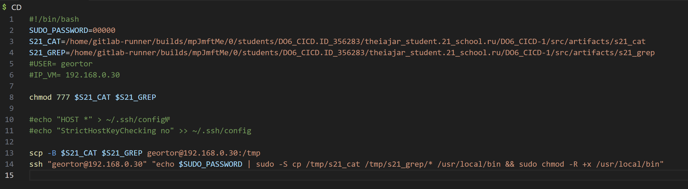

- результат скрипта
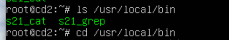

- pipline выполнен

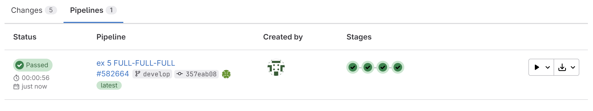

### Part 6. Дополнительно. Уведомления

##### Настроил уведомления об успешном/неуспешном выполнении пайплайна через бота с именем "theiajar DO6 CI/CD» в *Telegram*.

 - скрипт
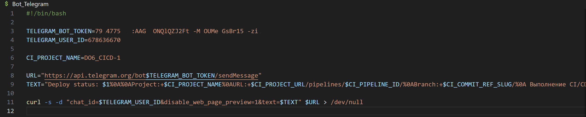

- результат

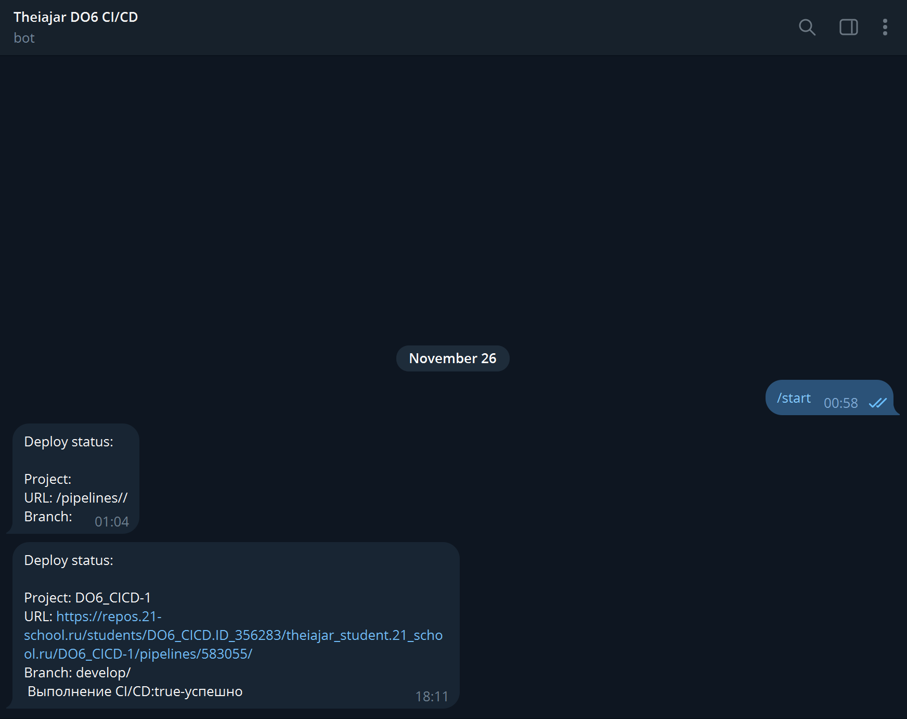